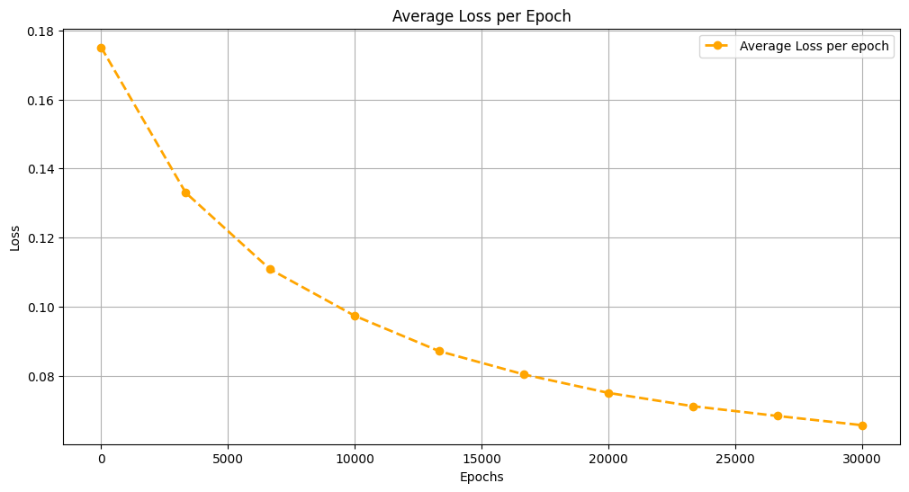
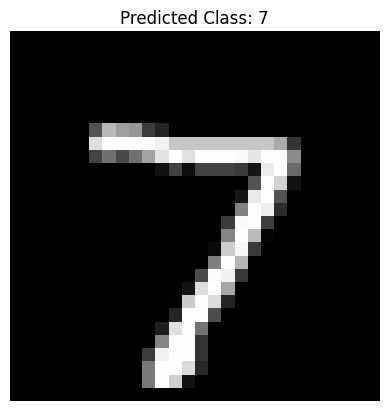

# Custom CNN Implementation Using NumPy

This project is a custom implementation of a Convolutional Neural Network (CNN) built entirely from scratch using **NumPy**. The goal of this project is to understand the inner workings of CNNs by implementing key components such as convolutional layers, activation functions, pooling layers, and a feedforward network without relying on high-level deep learning libraries like TensorFlow or PyTorch.

## Features

- **Custom Convolutional Layer**: Implements 2D convolution with trainable kernels and backpropagation.
- **Activation Functions**:
  - ReLU
  - Sigmoid
  - Softmax
- **Pooling Layer**: Implements max pooling with backpropagation.
- **Flatten Layer**: Converts multi-dimensional data into a 1D vector for fully connected layers.
- **Feedforward Network**: Fully connected layer with Xavier initialization and backpropagation.
- **Loss Function**: Multi-class cross-entropy loss for classification tasks.
- **Training Loop**: Custom training loop to train the CNN on the MNIST dataset.
- **Validation and Testing**: Includes validation and testing loops to evaluate the model's performance.

## Dataset

The project uses the **MNIST dataset**, which consists of 28x28 grayscale images of handwritten digits (0-9). The dataset is loaded using TensorFlow's `tf.keras.datasets.mnist` module.

## How It Works

1. **Data Preprocessing**:
   - The MNIST dataset is normalized to have pixel values between 0 and 1.
   - Labels are one-hot encoded for multi-class classification.

2. **Model Architecture**:
   - **Convolutional Layer**: Extracts features from the input image using a 5x5 kernel.
   - **ReLU Activation**: Introduces non-linearity.
   - **Max Pooling**: Reduces spatial dimensions while retaining important features.
   - **Flatten Layer**: Converts the 2D feature map into a 1D vector.
   - **Feedforward Network**: Fully connected layer with 10 output neurons (one for each digit).
   - **Softmax Activation**: Converts the output into probabilities for each class.

3. **Training**:
   - The model is trained using a custom training loop with backpropagation.
   - The loss is computed using multi-class cross-entropy.
   - Gradients are manually calculated and used to update weights and biases.

4. **Validation and Testing**:
   - The model is evaluated on the test set to compute accuracy.
   - A single test image can be visualized along with the predicted class.

## Results

- The custom CNN achieves reasonable accuracy on the MNIST dataset, demonstrating the effectiveness of the implementation.
- A comparison with a TensorFlow-based CNN is also included to validate the custom implementation.

## Code Structure

- **`Con2D`**: Custom 2D convolutional layer with forward and backward propagation.
- **`ReLU`, `Sigmoid`, `Softmax`**: Activation functions with forward and backward propagation.
- **`MaxPooling`**: Max pooling layer with forward and backward propagation.
- **`Flatten`**: Layer to flatten the input for the fully connected network.
- **`FeedForwardNetwork`**: Fully connected layer with Xavier initialization and backpropagation.
- **Training and Validation**: Custom loops for training and evaluating the model.

## Installation

1. Clone the repository:
   ```bash
   git clone https://github.com/Arjunprasaath/Custom-CNNs.git
   cd Custom-CNNs
   ```

2. Install the required libraries:
   ```bash
   pip install -r requirements.txt
   ```

3. Run the notebook:
   Open `main.ipynb` in Jupyter Notebook or any compatible environment and execute the cells.

## Usage

- **Training**: The training loop trains the CNN on the MNIST dataset for a specified number of epochs.
- **Validation**: The validation loop evaluates the model's accuracy on the test set.
- **Visualization**: Visualize the input image and the predicted class using the provided code.

## Example Output

### Training Loss


### Test Accuracy
The model achieves an accuracy of approximately **85.5%** on the MNIST test set.

### Single Image Prediction


## Comparison with TensorFlow Model

A TensorFlow-based CNN is also implemented for comparison. The TensorFlow model uses the same architecture and achieves similar results, validating the correctness of the custom implementation.

## Limitations

- The implementation is not optimized for speed and may be slower than library-based solutions.
- Only supports grayscale images and a single convolutional layer.

## Future Work

- Extend the implementation to support multiple convolutional layers.
- Add support for batch normalization and dropout.
- Optimize the code for faster training.
- Introduce convolution transpose for an autoencoder architecture.
- Build adam optimizer.
- Experiment with other datasets.


## License

This project is licensed under the MIT License. See the [LICENSE](LICENSE) file for details.

## Acknowledgments

- The MNIST dataset is provided by Yann LeCun and the TensorFlow team.
- Inspired by the desire to understand CNNs at a deeper level.

---
